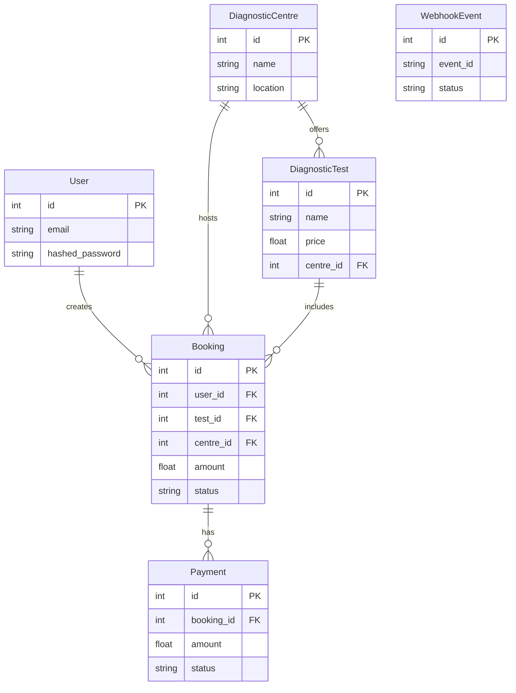

# Database Schema Design

This document details the database schema for the Healthcare Booking Service.

## Entity-Relationship Overview

The database is built using PostgreSQL and modeled with SQLAlchemy. The core entities are:
1. **User**: Represents patients booking the tests.
2. **DiagnosticCentre**: Represents physical locations offering tests.
3. **DiagnosticTest**: Represents specific medical tests available at a centre.
4. **Booking**: Represents an appointment made by a User for a DiagnosticTest at a DiagnosticCentre.
5. **Payment**: Represents the financial transaction for a Booking.
6. **WebhookEvent**: Tracks processed webhooks for idempotency.

## Tables

### 1. `users`
| Column | Type | Constraints | Description |
|--------|------|-------------|-------------|
| `id` | Integer | Primary Key | Unique identifier for the user |
| `email` | String | Unique, Not Null | User's email address |
| `hashed_password` | String | Not Null | Bcrypt hashed password |
| `created_at` | DateTime | Not Null | Timestamp of creation |

### 2. `diagnostic_centres`
| Column | Type | Constraints | Description |
|--------|------|-------------|-------------|
| `id` | Integer | Primary Key | Unique identifier |
| `name` | String | Not Null | Centre name |
| `location` | String | Not Null | Centre location |
| `created_at` | DateTime | Not Null | Timestamp of creation |

### 3. `diagnostic_tests`
| Column | Type | Constraints | Description |
|--------|------|-------------|-------------|
| `id` | Integer | Primary Key | Unique identifier |
| `name` | String | Not Null | Test name |
| `description` | String | Nullable | Test description |
| `price` | Float | Not Null | Cost of the test |
| `centre_id` | Integer | Foreign Key (`diagnostic_centres.id`) | The centre offering this test |
| `created_at` | DateTime | Not Null | Timestamp of creation |

### 4. `bookings`
| Column | Type | Constraints | Description |
|--------|------|-------------|-------------|
| `id` | Integer | Primary Key | Unique identifier |
| `user_id` | Integer | Foreign Key (`users.id`) | The user who booked |
| `test_id` | Integer | Foreign Key (`diagnostic_tests.id`) | The booked test |
| `centre_id` | Integer | Foreign Key (`diagnostic_centres.id`) | The centre location |
| `appointment_time` | DateTime | Not Null | Scheduled time |
| `amount` | Float | Not Null | Locked price at time of booking |
| `status` | Enum | Not Null, Default `PENDING` | `PENDING`, `CONFIRMED`, `FAILED`, `CANCELLED` |
| `created_at` | DateTime | Not Null | Timestamp of creation |
| `updated_at` | DateTime | Nullable | Last updated timestamp |

### 5. `payments`
| Column | Type | Constraints | Description |
|--------|------|-------------|-------------|
| `id` | Integer | Primary Key | Unique identifier |
| `booking_id` | Integer | Foreign Key (`bookings.id`) | Associated booking |
| `amount` | Float | Not Null | Payment amount |
| `status` | Enum | Not Null, Default `PENDING` | `SUCCESS`, `FAILED`, `PENDING` |
| `created_at` | DateTime | Not Null | Timestamp of creation |
| `updated_at` | DateTime | Nullable | Last updated timestamp |

### 6. `webhook_events`
| Column | Type | Constraints | Description |
|--------|------|-------------|-------------|
| `id` | Integer | Primary Key | Unique identifier |
| `event_id` | String | Unique, Not Null | Unique ID from payment provider |
| `status` | String | Not Null | E.g., "PROCESSED" |
| `created_at` | DateTime | Not Null | Timestamp of processing |

## Mermaid ER Diagram

